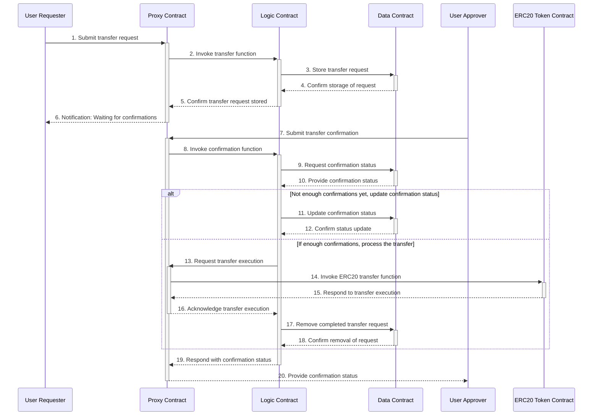

# Eth-Gateway CA 개발 개요 

#### 수정내역 

- <u>모든 수정 내역은 본문 내에서 밑줄 처리됨</u> 

###### 23/06/23 

- proxy contract <> 외부 cold wallet의 자산 리밸런싱 기능 추가 
- LM wallet 프런트엔드의 상태 추적 관련 내용 추가 
- 가비지 출금 요청 데이터의 삭제 기능 추가 

#### 개발 목표 

- **Upgradable Contract**
  - 컨트랙트는 필요시 업그레이드가 가능해야 할 것 
  - pointer / logic / data >> 3중 분할 구조를 이용할 것 
- **Multisig Confirmation**
  - 출금 요청이 승인되기 위해서는 2단계의 서명이 필요하도록 할 것 
    - gateway 서버의 서명 
      - transfer request를 data contract에 저장하기 위해서 필요  
    - approver 서명 
      - transfer request를 최종 승인하기 위해서 필요
      - View 페이지에서 요청 확인 후 메타마스크를 이용해서 서명 
      - 다수의 approver 등록 가능
        - <u>출금 요청 수량에 따라서 필요 서명 갯수를 0/1/2개로 분할</u> 

### Eth-Gateway Contract 전환 기술 구성 요소 

###### 게이트웨이 컨트랙트 계층

- **Pointer contract** 
  - 모든 외부 TX가 수신되는 컨트랙트 주소 / TX의 내용에 따라서 logic contract로 릴레이 / LM 밸런스를 소유
- **Logic Contract** 
  - 기능 설명 
    - pointer에서 relay되는 요청을 미리 저장된 로직에 따라 처리 

  - 필요 기능 
    - transfer request 관련 기능 
      - store transfer request
      - update confirmation status
      - call transfer function (완료 후 clear data)
      - <u>remove transfer request</u> 
        - <u>승인이 영원히 보류된 gabage data를 삭제하는 기능</u>
        - <u>owner에 의해서만 작동</u> 
      
    - 권한 관련 기능 
      - change owner address 
      - change gateway address
      - add approver / remove approver 
        - change parameter 		
- **Data contract**
  - 저장 정보 
    - 컨트랙트의 권한 정보 
      - **gateway address**: transfer request를 보낼 수 있는 주소 정보(게이트웨이) 저장 
      - **approver address**: 저장된 transfer request를 승인할 수 있는 사용자 주소 목록 
      - **owner address**: approver address를 추가 삭제, gateway address를 변경할 수 있는 사용자 주소 

    - **서명 관련 parameter** 값
      - transfer request의 LM amount에 따라 변동되는 **필요 서명 수**
        - <u>amount에 따른 서명 갯수 요구량은 0/1/2 로 확정</u> 
          - <u>data contract 내 parameter로 저장</u> 
            - <u>승인이 불필요한 최대 amount</u>
            - <u>승인 서명 1개가 필요한 최대 amount</u>
            - <u>그 이상은 승인 서명 2개 필요</u> 
      
    - 출금요청 정보
      - **transfer request storage** : 출금요청 ID, address, amount 정보 저장
      - **confirmation state storage** : 출금요청 ID, sequence[approver] 정보 저장  

###### 게이트웨이 서버 계층 

- LMC wallet, ETH wallet, 게이트웨이 클라이언트로 구성 
- 입금시 - 기존과 동일
  - proxy contract로 사용자의 입금
  - gateway node가 infura를 통해서 listen
  - LMC 내부 해당 사용자 주소로 토큰 발행 및 전송 
- 출금시 
  - infura API를 통해서 transfer request를 proxy로 전달 
    - 전달된 tx 요청에 대한 결과값을 listen
    - 해당 결과를 출금요청 View 페이지로 전달 
- <u>추가 기능 - Cold Wallet 기반 자산 리밸런싱</u> 
  - <u>gateway proxy contract가 보유한 LM 토큰을 회사가 관리하는 콜드월렛으로 분산시키는 기능</u> 
  - <u>게이트웨이 클라이언트에 의해 동작</u> 
    - <u>정해진 일정에 따라 배치 작동</u> 
    - <u>proxy contract와 cold wallet의 잔고 비교</u> 
      - <u>정해진 비율에 따라 잔고 리밸런싱</u> 
        - <u>proxy contract >> cold wallet 전송의 경우</u>
          - <u>일반 transfer request와 동일하게 동작</u> 
        - <u>cold wallet >> proxy contract의 경우</u> 
          - <u>user에 의한 내부 송금이 아니므로 입금 예외처리 할 것</u>
          - <u>게이트웨이 내 cold wallet 주소 정보 입력 / 입금자 주소 확인 후 예외 처리</u> 

###### 출금 요청 View 페이지 

- 출금요청 목록, 승인 상태 조회 가능한 페이지
- 해당 페이지에서 입금 관련 상태도 확인할 수 있도록 만드는 것도 고려중 

###### approver 메타마스크

- 해당 interface에서 출금요청을 tx로 approve

###### LM Wallet 송금 페이지 (플랫폼개발실 수정사항)

- <u>인출 요청에 대해서 해당 TX를 추적 / 정보 표출</u>
  - <u>전송중 / 전송 완료</u> 
  - <u>ERC20 Token Contract의 송금 기록 추적(infura)</u>
    - <u>전송 완료시 gateway proxy contract로부터 user address로의 tx 관측 가능</u> 

# Flow Diagram

1. Submit transfer request 
   - 게이트웨이 서버(User Requester)의 address로 부터 TX 수신 (출금요청 ID, address, amount 정보 포함)
   - logic contract의 transfer function을 호출 
2. Invoke transfer fuction 
   - proxy가 전달받은 출금 요청을 logic contract로 전달 
3. Store transaction request 
   - 최초 proxy contract로 전달된 출금요청 tx 내에 담겨있는 정보를 data contract에 저장 
     - transaction request storage - 출금요청 ID, address, amount 정보 저장 
4. Confirm storage of request 
   - data contract 내에 출금요청 정보가 저장됨을 logic contract로 응답 
5. Confirm transfer request stored 
   - proxy contract가 수신한 transfer request가 성공적으로 data contract로 전달되어 저장되었음을 응답으로 수신 
6. Notification: confirmation needed 
   - 게이트웨이 서버가 Infura API를 통해서 이벤트 결과 추적 
     - 전달한 출금요청이 승인 대기중임을 확인 
     - 해당 출금 요청 정보를 View 페이지로 전달 및 등록 
7. Submit transfer confirmation 
   - View 페이지를 통해서 보고 있던 approver
     -  metamask를 이용해서 해당 출금요청을 승인하는 tx를 proxy contract로 전송 
8. invoke confirmation function
   - Proxy Contract의 TX로 수신된 confirmation을 Logic Contract로 전달 
9. Request confirmation state
   - Proxy로부터 전달된 승인 정보 (승인된 출금요청 ID, approver의 address)를 수신 
10. Provice confirmations status 
    - Proxy로부터 전달된 승인 요청에 대해서 해당 transfer request의 승인 상태를 logic contract로 전달 
11. (confirmation이 충분하지 않은 경우) Update confirmation state
    - data contract 내에 저장되어 있는 confirmations state를 갱신 
12. Confirm state update
    - confirmation state가 업데이트 됨을 logic contract로 응답 
13. (충분한 confirmation이 모인 경우) Request transfer execution 
    - 10에서 전달된 정보를 통해서 logic contract는 confirm이 완료 확인 
    - transfer를 execute 하기 위해서 proxy contract에 요청(잔고 보유자가 proxy이기 때문)
    - Approver의 승인이 성공적으로 업데이트 되었음을 응답으로 수신 
    - <게이트웨이 서버> 해당 상태 변화에 대해서 infura를 통해서 확인 후 View 페이지에 반영할 것 
14. Invoke ERC20 transfer fuction 
    - proxy contract는 ERC20 token contract의 transfer function 동작을 요청 
15. Respond to transfer execution 
    - transfer function 동작 (사용자에게 토큰 이체)
16. Acknowledge transfer execution 
    - transfer가 성공적으로 완료되었음을 응답으로 수신 
17. Remove completed transfer request 
    - 완료된 출금요청에 대해서 data contract 내의 해당 데이터 삭제 요청
18. Confirm removal of request 
    - 삭제 완료 후 logic contract로 응답 전달
19. Respond with confirmation state 
    - 승인요청에 따라서 출금 요청 처리가 성공적으로 완료되었음을 응답
20. Provide confirmation status 
