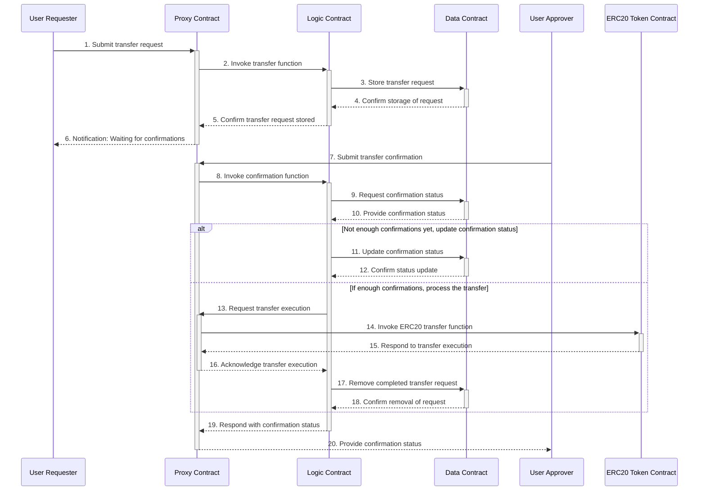

# LMC-ETH Gateway CA Development Plan

### What is LMC-ETH Gateway?

- What is LeisureMetaverse?

  - LeisureMetaverse is a Web 3.0 enabler to create sustainable social, cultural, and economic community through DAO. There are mainly two services, one is a NFT marketplace called "playNomm", the other is Web 3 creator-fandom community called "NOVA". 

- What is LeisureMetaveres Blockchain? 

  - LeisureMetaverse platform is a blockchain-based platform where thousands of users will interact each other while transmitting massive amount of data in the form of multimedia. 

    Although Ethereum is the most widely used blockchain platform and the best value creating platform for NFT, Ethereum is not suitable for launching and operating a full-size social networking service. This is because the service will be restricted due to the nature of the existing public blockchains with limited throughput, costly transaction fees and desperately low data storage capability. 

    Therefore, to provide existing web service level application onto the blockchain,  we build our own blockchain called LeisureMetaverse Blockchain (Hereafter, LMC). 

    However, LMC is a unique stand-alone blockchain, but it doesn't works as layer-1 blockchain, rather it works as a layer-2 of Ethereum. Using LMC-Ethreum gateway, LMC can send and receive its own data to Ethereum. 

- What is LM token?

  - LeisureMetaverse issued its own utility token, ‘LM’ to motivate trade and increase usability. LeisureMetaverse operates its own blockchain, but the LM token on LeisureMetaverse and the LM ERC20 token on Ethereum are interchangeable through LMC-ETH gateway. 

- What is LMC-ETH gateway? 

  - Basically, it is a two-way pegged gateway between LMC and Ethereum using a simple single hosting mode. 
    - Single hosting mode: the easiest way to implement two-way peg, the basic principle is the same as the single signature notary mechanism. The transaction participants send the digital assets on the mainchain to a single escrow EOA address, that is, the address of a fully trusted personal account or exchange. When the custodian receives and confirms the digital assets on the mainchain, the custodian sends the corresponding assets on the sidechain to the sidechain account of the transaction party.
    - This mode is easiest way to develop two-way pegged gateway, but its single escrow EOA address is point of exploit. 
  - To ensure a higher level of safty on gateway operation, it is inevitable to change the single escrow EOA address to CA using smart contract on Ethereum. 

### Objectives of LMC-ETH Gateway CA Development

- **Upgradable Contract**
  - The whole contract, including core logic and parameters, must be upgradable
    - To build an upgradable contract, we will use a structure of tertiary layers of pointer / logic / data contracts.  
- **Multisig Confirmation**
  - To confirm the withdrawl request, it is necessary to be signed by multiple entity 
    - Gateway Server's  Signature
      - Need to save a transfer request on the storage of data contract
    - Approver's Signature
      - Need to confirm transfer request finally
      - Verified outside approver will check the transfer request on view page, will sign on the confirm transaction using their metamask wallet
      - Can register multiple approvers 
        - Based on the number of token that withdrawal requested, quorum of approver's signature will be varied (0/1/2) 

## Flow of Deposit / Withdrawal

###### Required Condition

- Every user's address pairs must be stored in the system 
  - for the every user of LMC, LMC block stores their address as a state
  - To deposit / withdrawl LM token using gateway, user's Ethereum address shall be stored in the LMC user account state in the LMC block data 
- Deposit / withdrawal request of unregistered user will be pended unti they register their LMC-ETH address pair data in LMC 

###### Flow of Deposit  

- For the flow of deposit, it is quite simple 
  1. A user sends LM ERC20 token to ETH wallet address of two-way pegged gateway  in the Ethereum side
  2. If transaction success, the updated balance data will be recorded on the internal storage of LM ERC20 token contract
  3. Gateway client will listen the transaction using infura API 
  4. Detect the LMC address of the user who send the LM token from Ethereum mainnet side
  5. Mint exactly same ammount of LM token to the user's LMC address 

###### Flow of Withdrawal 

- For the flow of withdrawal, it is a bit complex 

  1. User send LM token in LMC to LMC wallet address of two-way pegged gateway in the LMC side 

  2. Gateway client listens the transaction, then provoke transfer request transaction to the proxy contract of LMC-ETH gateway contract on the Ethereum side
  3. Gateway client send the transfer request information to withdrawal request view page 
  4. Approvers tracks new transfer request on the view page, then sign and send confirmation transaction
  5. (If number of confirmations form a quorum) LMC-ETH gateway contract execute the LM ERC20 token transfer to the user's Ethereum address 
  6. After the finalization of LM token transfer, burn the transfer requested LM token inside the LMC to match the LM token balance between both side of gateway wallet 

### Source Codes for the LMC-ETH Gateway CA 

- LM ERC20 Token Contract  
  - Contract Deploy Address
    - ETH Mainnet: 0xc064F4F215B6A1E4e7F39bD8530C4dE0fC43ee9D
    - Sepolia Testnet: 0x7d94A1754b25B93ab2Ce5BbfFfE5232966a69a4b
  - Source Code
    - https://github.com/leisuremeta/leisuremeta-token

### Technical Structure of LMC-ETH Gateway CA 

###### Layer of Smart Contract on Ethereum

- **Pointer contract** 
  - The contract address where all the deposit/withdrawal request TXs will be  received.
  - Will relay the requested TXs to the logic contact based on the its content
  - Possesses Token Balance 
    - LM for Escrow 
    - ETH for gasfee 
- **Logic Contract** 
  - The contract that execute relayed from the pointer contract based on pre-defined logics
    
  - List of functions 
    - Function for transfer request 
      - store transfer request
      - update confirmation status
      - call transfer function (if transfer calling finished, then clear data)
      - remove transfer request 
        - remove gabbage transfer request data which will never be confirmed 
        - only accessible by contract owner
      
    - Function for owner 
      - change owner address 
      - change gateway address
      - add approver / remove approver 
        - change parameter 		
- **Data contract**
  - The List of Stored Data 
    - Ownership of the Contract  
      - **gateway address**: the gateway address that can send transfer request to the pointer contract 
      - **approver address**: list of approver's address who can confirm the transfer request
      - **owner address**: the contract owner's address who can add / remove approver's address or changes gateway address

    - Parameter for Transfer Request Confirmation
      - Quorum of signatures to confirm the transfer request
        - The quorum varies from 0 to 2, based on the amount to be sent  
          - Parameters will be stored in the data contract 
            - The maximum of mount without approver's confirmation (quorum = 0) 
            - The maximum of mount with only a single approver's confirmation (quorum = 1)
            - Above that, two approver's confirmation is needed (quorum=2)
      
    - Transfer Request Data
      - **Transfer request storage** : transfer request ID, destination address, amount 
      - **Confirmation state storage** : transfer request ID, sequence[approver's address] 

###### Gateway Server Client Layer 

- Consist of LMC wallet, ETH wallet and gateway client  
- Flow of Deposite (from ETH to LMC)
  - User transfer LM to proxy contract's address 
  - Gateway node will listen the event by infura service 
  - Gateway client will check the ETH address, will find paired LMC address of the user 
  - Gateway client will mint the same amount of LM token to the user's address inside the LMC
- Flow of Withdrawal (from LMC to ETH) 
  - User will transfer their LM token to gateway's LMC wallet 
  - Gateway client will send transfer request TX with user's transfer request data using gateway's ETH wallet 
    - Gateway client will listen the result of transfer request using Infura service
    - If transfer request tx is confirmed, the transfer request will be listed on the withdrawal request view webpage  

###### Withdrawal Request View Webpage  

- The webpage can see the list of requested transfers and its confirmation state 

###### Approver's Wallet

- The interface which approver can send confirmation tx for transfer requests

### Flow Diagram for Withdrawal 

1. Submit transfer request 
   - receive transfer request form gateway(User Requester)'s ETH wallet address including transfer request ID, destination address, amount informations
   - calling transfer function in the logic contract
2. Invoke transfer fuction 
   - relaying transfer request that proxy contract received to logic contract 
3. Store transaction request 
   - store the informations from the relayed transfer request to the storage in the data contract
     - stored items: transfer request  ID, address, amount 
4. Confirm storage of request 
   - response to the logic contract for storing transfer request data in the data contract
5. Confirm transfer request stored 
   - response to the proxy contract for the storing data on data contract by logic contract
6. Notification: confirmation needed 
   - gateway server listen the result of transfer request event using Infura API 
     - check the confirmation state of delivered transfer request  
     - Send the checked transfer request information to withdrawal request view page 
7. Submit transfer confirmation 
   - approver tracks new transfer request on the view page
     -  sign and send confirmation transaction for the transfer request on the view page using metamask wallet
8. invoke confirmation function
   - relay the confirmation transaction from proxy contract to logic contract 
9. Request confirmation state
   - request the confirmation state of transfer request (transfer request ID, approver's address) that already stored in data contract 
10. Provide confirmations status 
    - send the confirmation state of transfer request to logic contract 
11. (If number of confirmations lack the quorum) Update confirmation state
    - update confirmations state data in the data contract
12. Confirm state update
    - response to the logic contract of updating confirmation state in the data contract
13. (If number of confirmations form a quorum) Request transfer execution 
    - logic contract check the confirmation state(form a quorum)
    - request transfer LM ERC20 token to proxy contract (ERC20 balance belongs to proxy contract) 
    - receives responce that the changes in the confirmation state successfully updated by approver's confirmation 
    - (gateway server) listens the state change by infura API, then apply the change on the view page
14. Invoke ERC20 transfer fuction 
    - request to call the transfer method in the LM ERC20 token contract by proxy contract
15. Respond to transfer execution 
    - succesfuly send transaction using transfer method (send LM token to destination address)
16. Acknowledge transfer execution 
    - response to logic contract that the ERC20 transfer was successfully finished 
17. Remove completed transfer request 
    - request to delete the transfer request data for successfully finished request 
18. Confirm removal of request 
    - response to logic contrat for deleting transfer request data of successfully finished request 
19. Respond with confirmation state 
    - response to the proxy contract for the successfuly finished transfer request 
20. Provide confirmation status 
